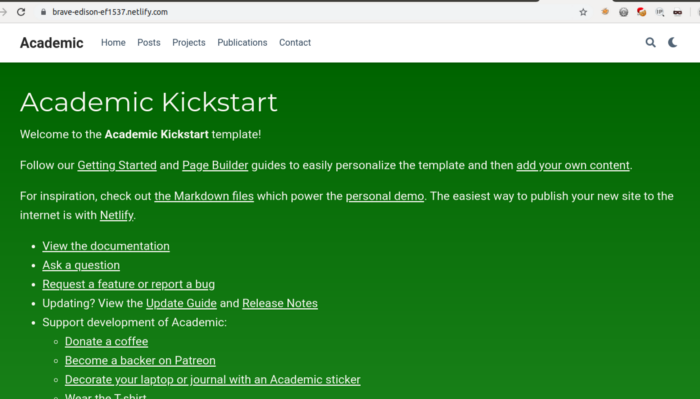

"Maybe I should create a website or blog. Showcasing a portfolio? (Bwahaha... First, you have to create a portfolio.:smile:) I just want a simple way to make and maintain a website. Hm... `blogdown`? Nice, I can do the hole thing in RStudio!" — or how I have fantasized about it months ago.

> Where he ask for what he can’t get, there he get what he don’t ask for.  
> — *Old Witch* from [The Treasure of Swamp Castle](https://www.imdb.com/title/tt0137226/)

Now, let's see how I managed to get to this point and what hindrances slowed me down. This first post serves as a memo :memo: to myself and maybe a helping hand for others.

# Background
I am familiar with using RStudio and the R language. If there is a way to make and publish a website using these tools, that would be neat! Furthermore, I may want to use some R code chunks in the posts. With these possible requirements I searched and found the `blogdown` package. This was the starting point and through the setup I frequently reevaluated the possibilities of creating a website which is summarized in the following sections.

### Static site generators
Basically there are two types of websites: **static** and **dynamic**. The following blogdown book link [2.1 Static sites and Hugo](https://bookdown.org/yihui/blogdown/static-sites.html) is a good comparison. Also, there was a temptation to use a **website builder**, but I rejected it based on portability and (then hoped) quickstart of the whole process. Good justifications are presented in the following links (from a web search `website builder cms vs hugo`):

- [Why I Chose Hugo Framework For My First Blog?](https://www.techighness.com/post/why-i-chose-hugo-framework-for-my-first-blog/)
- [Why I moved my personal blog from Wordpress to Hugo](https://martijnvanvreeden.nl/why-i-moved-my-personal-blog-from-wordpress-to-hugo/)
- [Jamstack](https://jamstack.org/) - there is a new movement in website and app building which relies on static site generators, just like Hugo

I chose static because its simplicity, portability. It will suffice the needs in the near future, so why not use the simpler approach?  

### Blogdown
`blogdown` has a thorough documentation ([blogdown: Creating Websites with R Markdown](https://bookdown.org/yihui/blogdown/)) and loads of websites were created using it (see [blogdown]() in Resources). Some of these websites have posts, tips about the setup or links to a GitHub repo which contains the source files. This is promising! (And also exhaustive to grasp it.)  

Blogdown uses the `hugo` framework, a **static site generator** to build the website from its sources. What does that mean? Hugo allows to create the content of the website by using simple markdown syntax (and some LaTeX math and shortcodes for supplement). Based on the markdown files, Hugo tries to create files readable by web browsers (this is called *build*). However, Hugo can not understand R markdown files, the flavor which allows R code chunks. But blogdown steps in and converts the R markdowns:

- to HTMLs. However this may lead to unwanted consequences seen in the post [Changing your Blogdown Workflow](https://drmowinckels.io/blog/2020-05-25-changing-you-blogdown-workflow/) (which was referenced alongside other bypass options of other blogdown users in the repo's  [v0.21 wishlist #476](https://github.com/rstudio/blogdown/issues/476) issue). Most of the issues have been resolved attested by [this issue comment](https://github.com/rstudio/blogdown/issues/476#issuecomment-708908238).
- to markdown files. Now, this can be processed by Hugo. This is an advanced option for building. To get an overview of the building options, see the blogdown book section [D.9 Different building methods](https://bookdown.org/yihui/blogdown/methods.html) and to see good charts describing this, see [Scientific and Technical Blogging: Radix vs. Blogdown](https://emitanaka.org/r/posts/2018-12-12-scientific-and-technical-blogging-radix-vs-blogdown/#fig:blogdown).

### Academic (Wowchemy) theme
An important part of the picture is the **Hugo theme**. As stated in the blogdown book (section [1.7 A recommended workflow](https://bookdown.org/yihui/blogdown/workflow.html)) the first task building a Hugo based site is to:

> 1. Carefully pick a theme at https://themes.gohugo.io...

At the time of my first attempts to create the site (mid September, 2020), the blogdown book suggested the **Academic theme** as *"strongly recommended for users in academia"* see the [history](https://github.com/rstudio/blogdown/commits/master/docs/01-introduction.Rmd) of the relevant book chapter and particularly this [pull request](https://github.com/rstudio/blogdown/pull/479). I wanted my site to be bilingual, Academic supported this, so I have chosen it. In the meantime, Academic have gone through a [rebranding](https://wowchemy.com/blog/introducing-wowchemy/) and became Wowchemy and adapted a Hugo modules structure. This ought to be adapted by blogdown and somehow the maintainer, Yihui Xie, managed it. But the hindrances made them to remove Academic as a recommended theme. Still, why do I stick with it? Mainly because:

- *popularity*, which means higher chance to get help if needed
- *active maintenance*, which means updates and new features
- *simple, yet functional design*, which allows different kind of contents (introduction page, blogpost, book chapter)

I almost throw it out and will do it if it's necessary. The above illustrates how important is to keep up with the changes. Sometimes these changes break code and sometimes the dependency hell messes up. This leads to the actual setup process.

# Setup and usage
## Basic setup
I read almost the entire blogdown book and done the setup [according to it](https://bookdown.org/yihui/blogdown/installation.html). However, the first obstacle showed up, as documented in this [Stack Overflow post](https://stackoverflow.com/q/63898557/14261671) by me.

The main problem was the need to install Go to use blogdown with Academic Hugo theme (in RStudio, but I suppose this was the case without RStudio). This was due to the theme's transition to Hugo module system. As I highlighted in the question, this was a shock for me, because *"Unlike other static site generators, the installation of Hugo is very simple because it provides a single executable without dependencies for most operating systems."* — as we can read in the blogdown book section [2.1 Static sites and Hugo](https://bookdown.org/yihui/blogdown/static-sites.html). My problem contradicted one of the main advantages of Hugo! Thanks to Yihui Xie, the maintainer of the blogdown package, it was resolved in the commit [da068a7](https://github.com/rstudio/blogdown/commit/da068a7d8b4b5c923044665de91c21906ca66a11) (where he expresses his dismay about the situation also). This commit was part of blogdown release [version 0.21](https://github.com/rstudio/blogdown/blob/2637c1cdfb997f0ff113cfa2225533a3d88f87c1/NEWS.md) (*"If a theme contains Hugo modules (e.g., the former hugo-academic theme), the modules will be resolved at the time when a theme is installed, which means users will not need to install Go or GIT to work with themes that contain Hugo modules."*). Note: if you follow the [installation documentation](https://wowchemy.com/docs/install-locally/) of the theme, it states to install Go (and other software).

After the software environment was set up, I followed along the theme docs: [Getting started](https://wowchemy.com/docs/get-started/). I wanted to get rid of most of the widgets (only keep the experience widget) on my home page. As the docs offer:
> Then, open your `content/home/` folder and set the active parameter to either true or false for each widget depending on if you wish to display it or not. Widgets that you don’t need **can alternatively be deleted** rather than setting active to false.

So I deleted them. But somehow I could not get rid of this homepage screen:

So after some foul language and reinstall I decided to keep all the widget files and set their `active` parameter to `false` in the front matter. And lo and behold, it was working. (By the way, this picture wasn't saved previously, but rather found with Google image search: 'hugo academic widget' :heavy_plus_sign: Tools :arrow_right: Color :arrow_right: green)

What have I done beside the setup?

- set the avatar (picture on home screen and after content), see [Wowchemy docs: Getting started](https://wowchemy.com/docs/get-started/#introduce-yourself)
- website icon, [Wowchemy docs: Customization](https://wowchemy.com/docs/customization/#website-icon)
- color themes, [Wowchemy docs: Customization](https://wowchemy.com/docs/customization/#color-themes)
- menus (en/hu), [Wowchemy docs: Language and translation](https://wowchemy.com/docs/language/#navigation-bar)
- widget spacing, [Add option to customize homepage section spacing? #433](https://github.com/wowchemy/wowchemy-hugo-modules/issues/433)
- settings (all in `config/_default/params.toml`)
  - no map
  - no contact widget
  - no comment

## Bilingual setup
Problems arose with my supposed bilingual setup also. The most heavy was documented in a [Stack Overflow post](https://stackoverflow.com/q/64688201/14261671) by me. When I tried to use the blogdown addin "New Post", the addin created, but did not load the new file. It was resolved by Yihui's commit in the blogdown repo. See the [blogdown]() section in the Resources menu to find descriptions about multilingual setup.  

There are two part of the setup: **content** and **interface** translation.

### Content translation
Content translation can be managed by two ways: **by filenames** and **by directory** ([Hugo Multilingual Part 1: Content translation](https://regisphilibert.com/blog/2018/08/hugo-multilingual-part-1-managing-content-translation/)). I chose the directory way, because I wanted to leverage page bundles by Hugo. I created (mirrored) the Hungarian content folder (`content/hu/`) according to the English one (`content/en/`) and modified the files.

- *How to edit what I can see in a browser tab?* This is the \<title\> element in an HTML file. This can be edited by the markdown file's `title` parameter in the YAML header. The title on the homepage is set in the `config.toml` file's title parameter. But how can I then set another title for my Hungarian home page? Maybe in `config/_default/languages.toml`? Worth a try. And voilá, it works. (See the files in my GitHub repo "website".) See the copyright translation point below for parameter redefining possibilities.
- *How to show Hungarian slug in a Hungarian post's URL?* I wanted to create the first dummy bilingual contents and link them (called *translation linking*). If a linking is in effect, the language switcher is visible. To make the Hungarian post's URL have a Hungarian slug, without accents (or without *diacritic*), the `slug` parameter can be set accordingly. Important for linking: *"By having the same path and basename (relative to their language content directory), the content pieces are linked together as translated pages"*.

### Interface translation
I would name two part of this task: **string localization** and **footer translation**.  

String localization is as easy as placing the particular language pack's internationalization (abbreviated as *i18n*, due to the 18 letters between the first and last letter) file in the `i18n` directory inside the project root. See [Hugo Multilingual Part 2: Strings localization](https://regisphilibert.com/blog/2018/08/hugo-multilingual-part-2-i18n-string-localization/) and Wowchemy documentation [Language and translation](https://wowchemy.com/docs/language/). My original problem was to translate the light/dark/automatic theme names, which was resolved by the suggestion in this Wowchemy dission [Light/Dark/Automatic translation #1891](https://github.com/wowchemy/wowchemy-hugo-modules/discussions/1891). I needed to find, then copy the original Hungarian i18n file `hu.yaml` to the root `i18n` directory, then update it according to the English `en.yaml` file.  

Footer translation is discussed in this section, due to its separation from content. It's a bit trickier than i18n files, as it includes work with *partials*. Long story short: copy a partial’s HTML file (<PARTIALNAME>.html) from its theme's `themes/<THEME>/layouts/partials/` folder into the site root's `layouts/partials/` folder for further customization (and overriding the original). See [Partial Templates](https://gohugo.io/templates/partials/) and Wowchemy docs [Customization](https://wowchemy.com/docs/customization). My original problem was to translate the footer copyright and credit text.

- copyright translation: I set `copyright` parameter in `config.toml` to empty, only use the Creative Commons option. This option has a string parameter in it, which need to be translated. However, this option reside in `params.toml` originally. How can I add the translation and have a meaningful organization of the language dependent options? This was solved with the aid of [this comment](https://github.com/wowchemy/wowchemy-hugo-modules/issues/67#issuecomment-279551652) on a multilingual issue from 2016 (!) in the Wowchemy repo. In short: *"It seems that Hugo allows you to put both the core Hugo variables like `title = "My blog"` and the Academic `[params]` variables (like `name = "My name in Russian"`) under the `[languages.X]` configuration section."*
- credit translation: I wanted to translate the Wowchemy credit in the footer, which can be done via an if-else clause in the `site_footer.html` file. This Wowchemy discussion [How can I add credits by the end of the page? #1886](https://github.com/wowchemy/wowchemy-hugo-modules/discussions/1886) answered it by showing an example.
- copyright icons: the Creative Commons icons weblinks seemed to be broken, therefore not showing. I needed to update them in the `site_footer_license.html` file.

## Usage
### Automatic deployment
After you write your content and want to publish it, you need to build the site from its source files. This will generate a public folder in the root folder. Then you have to copy these files in a directory of your website at a hosting service. This can be tedious and folks before me tried to get over it by automation with:

- shell scripts ([Deploying a hugo-based website on GitHub user pages | Marina Varfolomeeva](https://varmara.github.io/post/2019-01-15-deploying-a-hugo-based-website-on-github-user-pages/) and [Making a Website Using Blogdown, Hugo, and GitHub Pages | Amber Thomas](https://amber.rbind.io/2016/12/19/website/))
- external continuous integration (CI) services (outside of GitHub), some of them being a host also (like Netlify). For example [Hugo on GitHub Pages using Travis-CI for deployment](https://creaturesurvive.github.io/repo/blog/hugo-on-github-pages-using-travis-ci-for-deployment/) or see the blogdown book's [3. Deployment](https://bookdown.org/yihui/blogdown/deployment.html) chapter for elaborate discussion on the topic.

Not so long ago GitHub Actions were born and everything became possible inside GitHub. GitHub Actions is a built in CI/CD service in GitHub, therefore everything can be done inside GitHub. Based on the following posts were I capable to do the automatic deployment of my site:

- [Automate Deployment of Wowchemy Website onto GitHub Pages](https://www.jameswright.xyz/post/deploy-hugo-academic-using-githubio/)
- [Getting Started With Hugo Academic and Github Pages](https://lakemper.eu/blog/getting-started-with-hugo-academic-and-github-pages/)
- [Automatically Deploying a Hugo Website via GitHub Actions](https://www.morling.dev/blog/automatically-deploying-hugo-website-via-github-actions/)
- [Hugo: Deploy Static Site using GitHub Actions](https://ruddra.com/hugo-deploy-static-page-using-github-actions/)

Note: I heard of [forestry.io](https://forestry.io/) which makes it possible to edit the source files online and commit from there. A command line interface free option to manage the site.

### Current workflow
1. Open the (git versioned) website project in RStudio.
2. Create a new post using the "New Post" addin.
3. Write content.
4. Commit the changes.
5. Push the changes to GitHub [source repository](https://github.com/hermanp/website).
6. Let GitHub Actions do its job: build the website and deploy its `public` folder in the [GitHub Pages repository](https://github.com/hermanp/hermanp.github.io).

# Lessons learned
I see two strategies, but they do not exclude each other:

- careful documentation reading and slow, steady work: sometimes you NEED to read it
- do everything as fast as possible and if problems arise, new iteration starts (sometimes with a reinstall): do not hesitate long, make the most out of your valuable time

Do not stress yourself if you do not catch up to the speed others say of the setup time. Heck, there are many posts about the failures during setup! If you are lucky, you won't get stuck in the swamp. But luck is on those side who strive for it. :wink:
