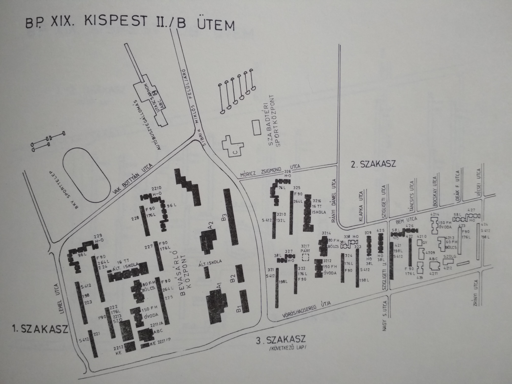
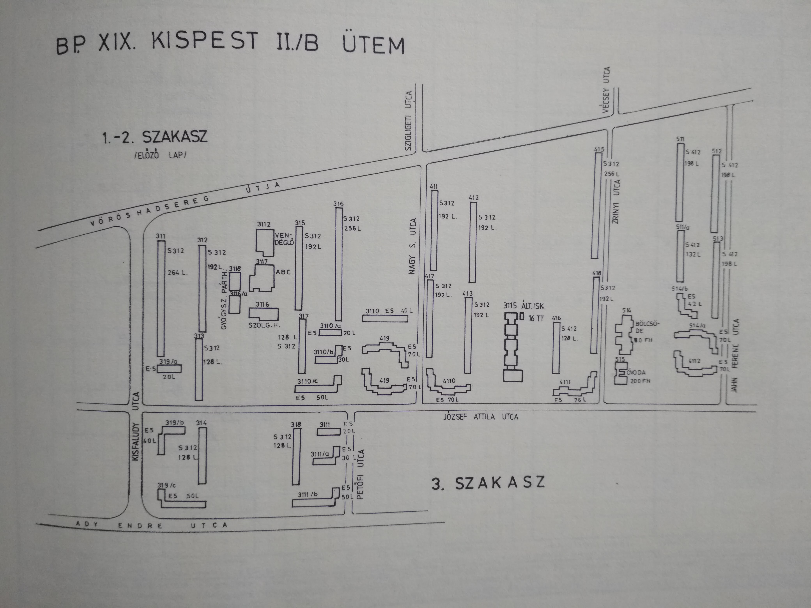

Ezen az oldalon gyűjtöm és rendszerezem mindazokat az információkat, amik hozzásegíthetnek a **panelházak térképi megjelenítésének** projektjéhez. Ehhez társul az érdeklődésem a **kispesti lakótelep** és története iránt, így építészeti és helytörténeti anyagokként is tekinthetők ezek.

A rendszerezés alapja, hogy felkutatok forrásokat és a kutatás közben elém kerülő forrás helyek, személyek, intézmények, fogalmak kigyűjtését is elvégzem. Ezáltal áttekinthetőbbé válik az érintettek köre, ami segíti a folytatást és a kapcsolatteremtést. Ha lenne egy egyszerű módja a markdownban folyamatábrák rajzolásának, szívesen használnám, hogy a kutatási lépéseket ábrázolhassam. A listák töltik be most ezt a szerepet.

Mivel a források néhány kivétellel magyar nyelvűek és a téma jellege miatt is korlátozott érdeklődést válthat ki a nem magyar olvasók között, ezért ha lefordítom, akkor a megjegyzéseimmel próbálom az angol nyelvű tájékozódást segíteni. Nehéz kialakítani egységes stílusú irodalomjegyzéket.

Ha bármi ötlet lenne a kedves olvasóban, írja meg nyugodtan! Örömmel fogadom az érdeklődést!

## Szakdolgozat
- Balázs Péter: [Budapest területének fejlődése 1945-től napjainkig](http://lazarus.elte.hu/hun/digkonyv/szakdolg/2012-bsc/balazs_peter.pdf). ELTE IK Térképtudományi és Geoinformatikai Tanszék, 2011. [Benne a városfejlesztési vezetőkről történeti áttekintés.]

## Cikkek
- Google: `panel térkép`, `panel épület típus`, `panelház típusok`
    - [Panel lakás alaprajzok](https://orszagos-tanusito-kozpont.hu/tanusitas/tanusitas-panel-lakas-alaprajzok)
    - Iván László (1996): Budapesti falanszterek, *Földrajzi Értesítő*, 45(1-2) pp. 73-99.
        - Budapesti Városépítési Tervező Vállalat, Városépítési Tervezési Önálló Osztály (1987): A budapesti lakótelepek főbb adatai (1947-1985).
        - Orbán Kristóf: [Kísérlet a magyarországi lakótelep újradefiniálására](http://www.terinno.hu/szamok/teruletfejelsztes_es_innovacio_2011_3.pdf), *Területfejlesztés és Innováció*, 5(3), p 2.
    - Építésügyi és Városfejlesztési Minisztérium Műszaki Tervezési Főosztály: Panelos lakóépületek típusterv katalógusa. Budapest 1976.
    - Balla Regina (2014): Horizontális hézag – a paneles lakóházak földszintje, TDK dolgozat, BME ÉPK Urbanisztika Tanszék
    - Benkő Melinda, Balla Regina (2016): Fundamentum – A paneles lakóépületek földszintje, *Építés – Építészettudomány*, 44(3–4) pp. 317–332.
    - Mészáros Ábel (2017. március 22.): [Útkeresés a 70-es évek lakásépítésében I.](http://lechnerkozpont.hu/cikk/utkereses-a-70-es-evek-lakasepiteseben-i), Lechner Tudásközpont, weboldal. Hozzáférés ideje: 2020.12.21.
    - Mészáros Ábel (2017. március 27.): [Útkeresés a 70-es évek lakásépítésében II.](http://uj.lechnerkozpont.hu/cikk/utkereses-a-70-es-evek-lakasepiteseben-ii), Lechner Tudásközpont, weboldal. Hozzáférés ideje: 2020.12.21. [H épülettípus létrejöttének körülményei, lakás alaprajz képek hivatkozva a Magyar Építőművészet folyóiratból]
    - Csaba Tímea: [How we really live in panel blocks](http://www.urbanisztika.bme.hu/segedlet/angol/panelstudy_cst.pdf), Den Haag Kiadó, Budapest, 2006. [Angol szaknyelv]
    - Weiszkopf András (2015): Lebstück Mária u. 47-53. Esettanulmány egy házgyári technológiával készült panelos lakóépület fenntarthatóságának lehetőségeiről, kutatási vázlat, BME Építőművészeti Doktori Iskola [Újpest átnézeti rajza, talán tud tippet adni a kispesti változat elkészítéséhez! (Épület alaprajz körvonal)]
    - Zorkóczy Zoltán: [Rövid módszertani segédlet energetikai tanúsításhoz, méretezéshez](https://www.e-epites.hu/sites/default/files/2016/LAKOSSAG/E_TANUSITAS/modszertani_segedlet20140714_si.pdf). Belügyminisztérium, 2014, 16 p. [házgyárak és lakótelepek összekapcsolása]
    - Szabó Balázs, Bene Mónika (2019): [Budapesti lakótelepek a panelprogram előtt és után](http://www.ksh.hu/docs/hun/xftp/terstat/2019/05/ts590504.pdf). *Területi Statisztika*, 59(5): 526–554. [Rendkívül fontos forrás! Lakótelep kutatások áttekintése, lakótelep és lakóépület lehatárolások módszertana.]
    > "Így több forrás összekapcsolásával végül egy lényegében teljes budapesti lakótelep-adatbázishoz jutottunk."
    - [Mi a különbség az 1980-as évek előtt és után épült panellakások között?](https://www.gyakorikerdesek.hu/otthon__egyeb-kerdesek__3220010-mi-a-kulonbseg-az-1980-as-evek-elott-es-utan-epult-panellakasok-kozott) - gyakorikerdesek.hu. Hozzáférés: 2021.01.06. [technológiai részletek az építésnél, technikai jellemzők, mire figyeljünk vásárlásnál]
- Google: `panel lakás alaprajz beépítés`
    - Józsa Katalin, Kulcsár Emese (dátum nem ismert): [Miért pont panel? Tervezők, ahogy látták, és látják ma](https://tdk.bme.hu/EPK/DownloadPaper/Miert-pont-panel-Tervezok-ahogy-lattak-es). BME ÉPK TDK [benne említés a Kispest II/A ütemről és a kispesti városközponról, amik Bálint Imre munkái]
        - FŐBER Kispest rekonstrukciója, Pestlőrinci lakótelep, [12./a kötet](http://www.urb.bme.hu/segedlet/segedletek/bp_lakotelep/kispest_lakotelep.pdf)
    - [A panelos épületek műszaki tervállománya](https://kreativlakas.com/iparositott-technologiaval-keszult-epuletek/az-iparositott-technologiaval-keszult-epuletek-csoportositasa/) [Érdekes komment a cikk alján Gonda Ferenc építészmérnöktől! Rákeresve erre a CD-re, nem találtam érdemi infót, úgy tűnik, már nem lelhető fel. Más hasznos cikk is van többlakásos témában.]
        - [Többlakásos és emeletes házak 4 kategóriája](https://kreativlakas.com/tobblakasos-hazak/tobblakasos-es-emeletes-hazak-4-kategoriaja/) [Vélhetőleg Reischl Antal (1979) féle könyvből vett át ábrákat. Látható az ábrákon a kézzel rajzolt mivoltuk és az a fajta stílus, ami például a Tankönyvkiadó Vállalatra, Műszaki Kiadóra és az Akadémiai Kiadóra jellemző.]
        - [A panelos építési módok kialakulása](https://kreativlakas.com/iparositott-technologiaval-keszult-epuletek/az-iparositott-technologiaval-keszult-epuletek-csoportositasa/)
- Hungaricana `Budapest és környéke általános rendezési terv 1971`:
    - Kőszeghy Lea (2007): Tömeges lakásépítés és várostervezés: A budapesti várostervezés szociológiai elemzése 1960-1975. In: URBS II : Magyar várostörténeti évkönyv, Budapest, Budapest Főváros Levéltára, pp. 293-322, 30 p. Benne
[A főváros Általános Rendezési Tervei](https://library.hungaricana.hu/hu/view/BFLV_urbs_02_2007/?pg=303&layout=s). [Jó összefoglaló!]
- Hungaricana `15 éves lakásfejlesztési terv`:
    - Kondor Attila Csaba, Szabó Balázs (2010): [A lakásépítési politika hatása Budapest térszerkezetére a Kádár-korszakban](https://library.hungaricana.hu/hu/view/BFLV_urbs_05_2010/?pg=390&layout=s). Urbs - Magyar várostörténeti évkönyv 5. (Budapest, 2010)
    - A Magyar Forradalmi Munkás-Paraszt Kormány 1002/1960. (I.10.) számú határozata [a 15 éves lakásfejlesztési tervről](https://library.hungaricana.hu/hu/view/DTT_KOZL_TanacsokKozlonye_1960/?pg=80&layout=s). Tanácsok Közlönye, 8. évfolyam, 3. szám
- Hungaricana `Preisich Gábor (1998): Budapest városépítésének története`:
    - Kocsis János Balázs (2010): [Döntéshozatali mechanizmus a fővárosban az 1960-as és az 1970-es években](https://library.hungaricana.hu/hu/view/BFLV_urbs_05_2010/?pg=376&layout=s). Urbs - Magyar várostörténeti évkönyv 5. (Budapest, 2010)
- Fővárosi blog keresés `kispest`
    - [Ötven éve írták. 1964 február](https://fovarosi.blog.hu/2014/02/19/otven_eve_irtak_1964_februar). Az itt hivatkozott részlet a Magyar Nemzet 1964. február 29-i számában jelent meg:
    > "Az Építőipari és Közlekedési Műszaki Egyetem városépítési tanszéke által készített terv szerint Kispest központját a Kossuth téren és annak körzetében alakítják ki."
- Google `"mot" típus terv`, pl. MOT.I.58/76 esetén mi az a MOT?:
    - Magyar országos típustervek katalógusa. Ennek több kötete létezik, lakó és műszaki épületekkel is. Az ÉM fogadja el.
- Google `lakás moti irányelv`:
    - Az építésügyi miniszter [7/1965. (XII. 30.) ÉM számú rendelete](https://library.hungaricana.hu/hu/view/DTT_KOZL_TanacsokKozlonye_1966/?pg=70&layout=s) a harmadik ötéves terv időszakában épülő lakóépületek és lakások tervezésének fontosabb irányelveiről.
    - Dömök Sándor: Tervezési irányelvek - A III. ötéves terv időszakában épülő lakóépületek és lakások tervezésének fontosabb irányelvei. Építésügyi Tájékoztatási Központ, Budapest, 1967. Kötetszám: 37-65. Oldalszám 40 oldal. [Magyar Országos Tervezési Irányelvek. Rövidítve MOTI.]
- Hungaricana `tervezési irányelv lakó*`:
    - A lakások és lakóépületek tervezésének fontosabb irányelveiről szóló 25/1960. (Ép Ért 20) ÉM számú utasítás.
    - Az Építésügyi és Városfejlesztési Minisztérium [10/1970. ÉVM számú közleménye](https://library.hungaricana.hu/hu/view/DTT_KOZL_TanacsokKozlonye_1970/?pg=340&layout=s) a ME 95—67 számú, a panelos lakóépületek tervezéséről és kivitelezéséről szóló Műszaki Előírás módosításáról.
- Hungaricana `tipusterv`:
    - [Új Típusterv Katalógus megjelenése](https://library.hungaricana.hu/hu/view/DTT_KOZL_TanacsokKozlonye_1960/?query=%C3%89M%20tipusterv&pg=206&layout=s), *Tanácsok Közlönye*, 1960, 8. évfolyam, 16. szám
- [Az építésügyi és városfejlesztési miniszter 1/1909. (I.8.) ÉVM számú rendelete az építési tipizálásról](https://library.hungaricana.hu/hu/view/DTT_KOZL_TanacsokKozlonye_1969/?pg=71&layout=s). Tanácsok közlönye, 1969, 17. évfolyam, 1. szám
- Hungaricana `SZO=(típusterv OR tipusterv) AND DATE=(1965--1966)`:
    - [Az ezredik panellakás](https://library.hungaricana.hu/hu/view/DunantuliNaplo_1965_10/?pg=124&layout=s). *Dunántúli Napló*, 1965. október 22., 22. évfolyam, 249. szám. [Benne Juhász Ferenc, a Baranya megyei Építőipari Vállalat főtechnológusát, a panelgyártás technológiájának kidolgozóját, Tillai Ernő építészt, a panelépületek prototípusának és típusterveinek készítőjét és Wolf István építésvezetőt, aki az ezer lakás összeszerelését irányította szólaltatták meg.]
- Kondor Attila Csaba – Szabó Balázs: [A lakáspolitika hatása Budapest városszerkezetéreaz 1960-as és az 1970-es években](http://www.mtafki.hu/konyvtar/kiadv/FE2007/FE20073-4_237-269.pdf). *Földrajzi Értesítő* 2007. LVI. évf. 3–4. füzet, pp. 237–269.
- Hungaricana ``:
    - Réfi Oszkó Magdolna: [Műszaki tervdokumentumok az államosított építőiparban](https://library.hungaricana.hu/hu/view/LeveltariKorpusz_LevModFuz_09/?pg=0&layout=s). Levéltári módszertani füzetek. Bp, 1990, Új Magyar Központi Levéltár, 340 p. [Benne: Az állami műszaki tervező szervezet kialakulása és fejlődése 1948-tól napjainkig. A beruházások tervezésének és lebonyolításának rendszere. Az építési műszaki tervdokumentumok fajtái és tartalma.]

## FSZEK
Fővárosi Szabó Ervin Könyvtár (Központi Könyvtár, Budapest Gyűjtemény). Keresés a [katalógusban](https://saman.fszek.hu/WebPac/CorvinaWeb):
- `kispest` kulcsszó, 315 találat:
    - Fodor L. István: Kispest: új városrész születik. _Élet és tudomány_ 33. évf. 39. sz. (1978), p. 1235-1237.
    - Fucskó Hajnalka: Megtorpant a lépcsőzetes program : Kispest nem adja fel. _Magyar Nemzet_ 58. évf. 175. sz. (1995), p. 8.
    - Gulyás Teréz: A kispesti városrészközpont és környéke. _Városépítés_ 11. évf. 3. sz. (1974), p. 34-35.
    - Kálmánchey Endréné: A kispesti lakótelep közlekedési kapcsolatai. _Városi Közlekedés_ 23. évf. 2. sz. (1983), p. 93-96.
    - Nyárádi Éva: Várospolitika Kispesten. _Budapesti Fórum_ 7. évf. 2-3. sz. (1987), p. 99-101.
    - Oszlay István: [Új városközpont a régi Kispesten](http://apps.arcanum.hu/app/budapest/view/Budapest_1981/?query=SZO%3D(kispest*)&pg=318&layout=s). _Budapest_ 19. évf. 7. sz. (1981), p. 5-7.
    - Vedres György: Várostervezők gondjai. _Budapest_ 10. évf. 7. sz. (1972), p. 7-9.
    - Alapfokú ellátó központ, Kispest. _Magyar Építőipar_ 33. évf. 11. sz. (1984), p. 676-677.
    - Kasza Sándor: Kispest : XIX. kerület. CEBA Kiadó, Budapest, 2006, 120 p.
    - Kispest, Budapest XIX. kerülete. A kerület vezetőinek, új létesítményeknek a fotójával. XIX. ker. Tanács, Budapest, 1985, 23 p.
    - A budapesti célcsoportos és magánerős komplex VI. ötéves tervi lakásépítés: hálós elemzés. Tanulmányok, helyszínrajzok, tervrajzok, táblázatok, grafikonok. (kidolgozta az Építésgazdasági és Szervezési Intézet 31. Főosztály Lakótelep Szervezési Osztálya) Építésügyi Tájékoztató Központ, Budapest. 
        - 9., 1981-1983.- 1981. - 313 p. - Készült: 1981. júl.
        - 10., 1981-1983. - 1982. - 324 p. - Készült: 1982. febr.
        - [11.], 1982-1984. - 1982. - 341 p. - Készült: 1982. aug.
        - [12.], 1982-1984. - 1983. - 308 p. - Készült: 1983. jan.
        - [13.], 1983-1985. - 1983. - 325 p. - Készült: 1983. júl. 
- `házgyár`:
    - Az V. ötéves tervben Budapesten építhető házgyári lakóépületek sorozattervei / [összeáll. Garai László, Szvoboda Imréné] ; [közread. a] FŐBER, Bp., 1976
    - Panelos lakóépületek típusterv katalógusa : budapesti házgyárak : 43. sz. Állami Építőipari Vállalat (összeáll. a Tervezésfejlesztési és Típustervező Intézet). ÉVM Műszaki Tervezési Főoszt., Budapest, 1976, 72 p.
    - Csaba László: A Budapesti 4.sz. Házgyár sorozattervei. _Műszaki Tervezés_ 14. évf. 3. sz. (1974), p. 16-22.
    - Csorba Zoltán: Panelos lakóépületek a Budapesti 3.sz. Házgyár elemeiből. _Műszaki Tervezés_ 15. évf. 4. sz. (1975), p. 10-14.
    - Fülöp Imre: Budapesti 4. sz. Házgyár. _Ipari Építészeti Szemle_ 29. évf. (1979), p. 6-8.

## Hungaricana Könyvtár
[Hungaricana Könyvtár](https://library.hungaricana.hu/hu/)

### BFT VB
Budapest Főváros Tanácsa Végrehajtó Bizottsága üléseinek jegyzőkönyvei

- keresés: `Budapest Főváros Tanácsa Végrehajtó Bizottsága kispest`, 175 találat; `Budapest Főváros Tanácsa Végrehajtó Bizottsága XIX. ker. Kispest II/B. ütem`, 14 találat; `Budapest Főváros Tanácsa Végrehajtó Bizottsága XIX. ker. beruházási program`, 43 találat; `XIX. ker Tanács végrehajtó bizottság`, 59 találat; `kispest "beruházási program"`, 422 találat. Rendezés: alapértelmezett (időrendi).
    - *1988. június 29.*: Javaslat a XIX. ker. Vörös Hadsereg útja – Corvin krt. - Ady E. utca – Mátyás király krt. által határolt terület lépcsőzetes szanálása VII. ötéves tervi lehetőségeire.
    - *1986. szeptember 10.*: A VII. ötéves tervi beruházási programok helyzetének áttekintése, javaslat a módosítások rendjére. 
    
    > "XIX., Kispest ltp. II/B ütem. A beruházási programban 8369 db lakás került jóváhagyásra. Az időközben érvénybe lépett "E" program és a pótlólag telepített 2 db garzonház megvalósításával a lakásszém 8562 db-ra emelkedett."
    
    - *1985. július 31.*: Javaslat a VII. ötéves tervi, kiemelten az 1986-87. évi lakásépítési helyekre. [Benne Kispest III. ütem terület, mely nem azonos a máshol olvashatóval, előkészítésének elvetése]
    - *1985. április 24.*: Jelentés a VII. ötéves tervi lakásépítési feladatok előkészítéséről, különös tekintettel az 1986-1987. évi lakásépítési feladatokra. 7. számú melléklet: Nagyobb VII. ötéves tervi új induló telepszerű lakásépitési területek. Közte: XIX., Kispest, Corvin krt.
    
    > "a 8. és 9. oldalon felsorolt lakótelepek beruházási programjait folyamatosan, még ez évben [1985] terjessze a Végrehajtó Bizottság elé jóváhagyás végett." 
    
    - *1982. június 9.*: Beszámoló jelentés a XIX. ker. Kispesti lakótelep I. és II/A ütemek kivitelezésének befejezéséről [Hivatkozik az 1977. II. 2-i ülésen a 114-122/1977.sz. V.B. határozatokkal elfogadott II/A ütem beruházási programjára. Megemlíti, hogy többször módosították az I. ütemet, nem lehet mindegyik hivatkozást beazonosítani.]
    - *1982. március 3.*: Új egységesített lakóház, illetve lakástípusok műszaki-gazdasági tervezési rendszerének bemutatása, különös tekintettel a fővárosi igények érvényesítésére. [az E sorozat tervei, épület és lakásváltozatokkal, LAKÓTERV, III. iroda]
    
    > "Különösen a szűk, étkezésre alkalmatlan konyhák állnak a jogos kritikák középpontjában." és "az új tervek áttérnek a lakások, közlekedők/lépcsőházak/ tipizálására, a korábbi épület-tipizálás helyett." 
    
    - *1981. október 28.*: Tájékoztató a XIX. ker. Kispest rekonstrukciójával kapcsolatos beruházások helyzetéről. [előzmények, tervek, ütemek, időpontok, térkép, kispesti áruház]. 190-206. oldal
    - *1981. február 11.*: A XIX. kerületi délpesti intézményközpont további tervezési munkáinak leállítása, [indoklással](https://library.hungaricana.hu/hu/view/HU_BFL_XXIII_102_a_1_1981-02-11/?pg=205&layout=s). 
    - *1980. július 30.*: Jelentés a VB határozatok végrehajtásáról. [hivatkozik az 1980. február 14-i ülés határozatára] 
    
    > "Fővárosi Városrendezési és Építészeti Tervvéleményező Bizottság elfogadta a II/B. ütem 2. és 3. szakaszára vonatkozó színmintákat." (197-198. o.), 1. melléklet a színezés és a zajvédő dombokról (215-216. o.)
    
    - *1980. február 14.*: A XIX. ker. Kispest II/B ütem beruházási programja
    - *1980. január 30.*: A XIX. ker. Kispest II/B ütem beruházási programja
    - *1979. szeptember 28.*: Jelentés a Tanács határozatainak végrehajtásáról és tájékoztató a Végrehajtó Bizottság két tanácsülés közötti munkájáról. [A Végrehajtó Bizottság megtárgyalta: a kispesti fűtőerőmű bővítésének többletköltségeiről szóló előterjesztést, a dél-pesti intézményközpont beruházási célját; pénzösszeg, időpont, ütem].
    
    > "A Tanács 1979. március 27.-i ülésén tárgyalta meg és fogadta el a további munka alapjául a főváros 15 éves lakásépítési és telepítési koncepcióját"
    
    - *1979. július 4.*: A XIX. ker. Kispest II/B. ütem beruházási programja
    - *1979. május 22.*: A dél-pesti intézményközpont beruházási célja (I. ütem) [hivatkozik az 1978. december 20-i ülésre, létesítmények, parkolók, tervezési, kivitelezési időpontok, pénzösszegek és térkép, ami megegyezik a hivatkozottal]
    
    > "Az I. ütem, elkészültével visszapótolja a lakótelep épitése során szanálásra kerülő kereskedelmi és ipari szolgáltatói létesítményeket".
    
    - *1978. december 20.*: A dél-pesti városrész központ beépítési terve a XIX. kerületi (kispesti) intézményközpontban [hivatkozik az 1977. október 12-i ülésre]
    - *1977. december 21.*: A XIX. ker. Kispest II/B. ütem beruházási programja [hivatkozik rá az 1981. október 28-i tájékoztató]
    - *1977. október 12.*: A XIX. ker. Kispest városközpont intézményközpontja [hivatkozik az 1976. december 8-i határozatra, az 1977. február 2-i II/A ütem tárgyalásra. Részletes rendezési terv térképpel, melyet 1974. május 24-én fogadtak el, létesítmények jegyzéke és nagyságrendje, vázlatterve]
    - *1977. augusztus 31.*: A XIX. ker. Kispest II/B ütem beruházási programja
    - *1977. február 2.*: A XIX. ker. Kispest városközpont II/A ütem beruházási programja [hivatkozik rá az 1981. október 28-i tájékoztató, hivatkozik az 1973. december 19-i beruházási programra, térkép]
    - *1976. december 8.*: Határidőmódosítási kérelem. XIX.ker.Városközpont, rendezési terv. 687. o. 
    - *1976. november 10.*: Beruházási programok előterjesztésének határidő módosítása, 594-595. o.
    - *1974. április 10.*: Javaslat a főváros V. ötéves lakásépítési koncepciójára. [benne fejlesztési indoklás, lakásépítés feltételei, közút, közművek, tervellátottság. Nincs térkép.]
    
    > "A terület tervezése késésben van; a részletes rendezési terv a folyamatban lévő tervpályázat eredményétől függően csak 1974-ben készíthető el."
    
    - *1973. december 19.*: XIX. ker. Kispest, lakótelep I. ütem módosított beruházási programja [hivatkozik rá az 1981. október 28-i tájékoztató, térkép a régi telkekről és a tervezett épületekről]
    - *1973. június 6.*: utca elnevezések megszüntetése Kispesten [Zeneköltő utca, Zenekar utca, Piac tér, Viadal utca, stb.]
    - *1972. április 12*: Területismertető műleírás az V. ötéves terv budapesti lakásépítésének telepitési javaslatához. XIX. Kispest központ. 147-149. [közmű-, úthálózat, II. sz. házgyár termékei, tervellátottság, nincs térkép]
    - *1968. december 4.*: Városközpontok építése a XIX. és a XXII. kerületben [mit szanálnak, mit építenek, megoszlások, nem hivatkozik előzményekre, nincs térkép]
    
    > "A kispesti lakások nem szerepeltek ebben [a III.] az ötéves tervben, csak vonal alatt, mint előkészitendők. Valószinüleg a IV. ötéves terv első felében inditjuk el. A XIX. ker. általános városfejlesztési tervével összhangban van ez a rész."
    
    - *1964. július 22.*: A XIX. ker. Kispest központjának és környékének részletes rendezési terve [egyáltalán nem részletes, nincs térkép]

- keresés `XIX kerület településfejlesztési tervjavaslat`, 8 találat:  
    - *1968. december 18.*: Javaslat a XIX. ker. településfejlesztési tervére. Hivatkozza Budapest Főváros Tanácsa 1969. január 28-i ülése. [térképvázlatok, grafikonok, utca és épületfotók, rendkívül részletes! Érdemes az érintett személyek neveit kigyűjteni, mert későbbi kereséshez felhasználható!]

- A Budapest Főváros Tanácsa 1959. szeptember 30-i tánácsülésén hivatkozva (lásd lejjebb), `budapest rendezési terv` kapcsán:
    - *1959. szeptember 30.*: Budapest és környéke általános rendezési tervének elkészítése. Benne [térkép](https://library.hungaricana.hu/hu/view/HU_BFL_XXIII_102_a_1_1959-09-30/?pg=96&layout=s) Budapest környék fejlesztési programjáról.
    
    > "A Fővárosi Tanács VB. Városrendezési és építészeti osztálya Budapest általános tervét elkészítette. [...] A tervet Budapest **Főváros Tanácsának Végrehajtóbizottsága** és a Magyar Dolgozók Pártja Budapesti Pártbizottságának **1955. február 11-i** közös ülése tárgyalta"  
    > "A hivatkozott határozat értelmében a VB. Városrendezési és építészeti osztálya az általános terv alapján, elsősorban az ütemterv és a részletes tervek kidolgozásának elősegítése céljából, 1959. december 31-ig elkészíti az egyes városrészek u.n. kerületi alapterveit. Ezek a tervek lényegében az 1:20000-es léptékben készült általános terv megállapításait pontosabb területlehatárolással és az összefüggések fokozottabb érvényesítésével 1:5000-es léptékben rögzítik. Ezek a tervek mind a területfelhasználás, mind a forgalmi úthálózat, mind pedig a város építészeti kialakítása szempontjából a részletes tervek kidolgozása és a végrehajtás ütemezése számára egyaránt egyértelmű alapul szolgálnak."  
    > "Utasitja a Városrendezési és építészeti osztályt, hogy egészítse ki az 1955-ben tárgyalt Budapest általános városrendezési tervét a városkörnyékének rendezési tervével [...] a szükséges korrekciók végrehajtása és egyeztetések után Budapestnek és környékének rendezési tervét terjessze a Fővárosi Tanács elé."
    
    - *1955. február 11.*: Budapest Általános Városrendezési Terve. [A terv három tervlapjára hivatkoznak, a terv mellékleteiként további hét darab térkép kerül felsorolásra: övezetbeosztás, lakásszám és közintézményi helyek, zöld és üdülőterületek, termelési területek, közműhálózat, ütemezési javaslat pl. 90000 lakás elhelyezésről, jelentős útvonalak és terek részletes beépítései vázlatai]
    
    > "A Főváros Tanácsának Végrehajtóbizottsága Budapest általános tervét megállapítja a bemutatott 1955. évi január hó 7-én kelt tervlapok (területfelhasználás, közlekedési hálózat, városépitészeti kialakítás) szerint." [erre a három térképre, másnéven tervlapra hivatkoznak közben, de nincs mellékelve]  
    > "Zártsorú nagyvárosias jelleggel alakítja ki a legjelentősebb peremkerületek: Óbuda, Ujpest, Rákospalota, Zugló, Kőbánya, Kispest és Erzsébet, továbbá Csepel és Budafok központjait, azokat szervesen összekapcsolja a belső várostesttel, a bevezető főútvonalak /Knurr Pálné utca, Béke út, Thököly út, Kerepesi ut, Üllői ut, Fehérvári ut, stb./ mentén tervezett nagyvárosias beépítéssel." [Ez látható a későbbi térképen!]
    
    - *1955. február 3-4.*: Budapest általános városrendezési tervének nyilvános vitája [Nincs térkép, csak a hivatkoznak rá, ahogy 1955. február 11-i BFT VB ülésen, akár térképként, akár tervlapként.]

- keresés `Budapest és környéke általános rendezési tervének elkészítése`:
    - *1960. március 28.*: Budapest és környéke általános városrendezési tervének elkészítése. [Nem ejtenek szót benne Kispestről, de egy jó térkép van benne, amin lakástelepítési területek javaslatai vannak megjelölve és Kispest területén nincs ilyen. Ezzel egybecsengenek Kőszeghy Lea tanulmányának állításai.]

- egyszerűen ráakadtam `kispest XIX rendezési terv` közben:
    - *1981. február 11.*: Budapest és környéke általános rendezési tervének felülvizsgálata.
    - *1981. június 3.*: Budapest főváros VI. ötéves területfejlesztési tervjavaslata.

- keresés `(III OR harmadik) ötéves terv lakástelepítés`:
    - *1967. június 7.*: „A budapesti lakásépítés, elosztás, telepítés és felújítás néhány időszerű problémája” c. témában a Budapesti Párt Végrehajtó Bizottság által hozott határozatokról.
    - *1965. október 27.*: Előterjesztés a III. ötéves terv lakástelepítésének módosításáról. [Kispest még 500 lakással szerepel. Előzmény összefoglaló az elején.]
    - *1962. szeptember 19.*: Előterjesztés a III. ötéves terv lakásépítkezéseinek területi elhelyezéséről. Ez szerepelt az MSZMP BP VB ülésén 1962. szeptember 3-án.

- keresés: `(XIX OR kispest) beépítési terv`
    - *1964. szeptember 16.*: Jelentés Budapest lakásépítésének helyzetéről. [Benne: lakás és lakó statisztikák, II. és III. ötéves tervi feladatok, építési technológiák szerinti megoszlás a II. ötéves tervben, a III. ötéves terv lakásépitési feladatainak előkészítése, Kispest beruházási programja készítés alatt. 1. sz. melléklet: III. ötéves lakásépitési területek előkészítésének részletes ismertetése, benne Kispest.]

- Hungaricana: `Budapest és környéke általános rendezési terv 1971`:
    - *1973. december 5.*: Jelentés az V. ötéves lakástelepítési terv előkészítése érdekében eddig tett intézkedésekről, javaslat a további feladatokra. [Benne: A koncentrált lakástelepités szempontjából számbajövő területek kiválasztása, a IV. ötéves terv lakástelepítésének matematikai programozása. Térkép!] De ugyanezen az ülésen:
    
    > "Zala megye és a Kispesti Közért Vállalat megállapodása alapján a megyei Húsipari Vállalat és a Nagykanizsai Sörgyár folyamatosan szállít húskészítményt, valamint sört a kerület üzleteibe."

- hivatkozás az MSZMP BP VB 1967. október 27-i ülésén:
    - *1967. szeptember 25.*: A IV. és az V. ötéves terv lakásépítési javaslata. [Benne Kispesti tervezett lakásszámok táblázatokban. Térkép a IV. ötéves tervi telepítési javaslatról.]

- már nem tudom honnan:
    - *1969. június 25.*: Jelentés a IV. és V. ötéves lakásépítési terv előkészítéséről.

- keresés `ötéves lakástelepítés lakásépítés terv javaslat`:
    - *1970. december 23*: Jelentés a IV-V. ötéves fővárosi lakásépítési program előkészítésének helyzetéről. [néhány számadat: V. ötéves 6000 lakás, BULAV által 1972-ben átadott 60 db (?), IV. ötéves 600 lakás.]

- vegyes:
    - *1972. április 12*: Az V. ötéves terv lakásépítési terv és telepítésének előkészítése. [keress `kispest`-re benne, fellelés oka: `kispest "117oo"` figyelj a nullák mint "o" szerepeltetésére! Keresés indok: 1969. június 25-i ülés szerint a részletes rendezési terv szerint építhető lakásszám 11700. Ezzel szemben nincs is leírva benne ez a szám! Honnan vették akkor?] [térkép](https://library.hungaricana.hu/hu/view/HU_BFL_XXIII_102_a_1_1972-04-12/?pg=36&layout=s) a lakástelepítési javaslatról, és az I. és II. alternatívák szerinti telepítésekre.
    - *1972. április 26.*: Az V. ötéves terv lakásépítéssel kapcsolatos teendői. Az 1972. április 12-i ülés megtárgyalása, mert akkor levették a napirendről, csak az előterjesztés olvasható ott. Itt térkép, táblázat nincs.
    - *1973. február 28.*: Jelentés az V. ötéves terv lakásépítési terve előkészítése érdekében eddig tett intézkedésekről, javaslat a további feladatokra.
    - *1975. október 29.*: A főváros V. ötéves lakástelepítési és lakásépítési terve. [Térképek!]
    - *1976. október 26.*: Jelentés az V. ötéves tervidőszakban kezdődő komplex lakásépítési beruházások helyzetéről. [és] Jelentés a VI. ötéves tervidőszak lakástelepítésének és lakásépítésének előkészítéséről.
    - *1978. június 21.*: A főváros 1976-1990. közötti 15 éves lakásépítési és lakásfejlesztési programja.

- keresés `"Kispest III. ütem"`:
    - *1977. december 21.*: Az 1981-1982. évekre vonatkozó és a VI. ötéves tervi előzetes lakásépítési javaslat. [Benne Kispest III. ütem! Térkép! Táblázat! Területleírás!]
    - *1979. március 27.*: A főváros 15 éves lakásépítési és telepítési tervének koncepciója.

- keresés `(III OR harmadik) "ötéves terv" típusterv`:
    - *1963. március 20.*: Jelentés a budapesti lakáshelyzetről és a lakásgazdálkodás rendszeréről. Ennek szerkesztett jegyzőkönyvében:
    
    > "Az ÉM-nek egyébként egy száma fix: az, hogy a III. ötéves tervben 53 m2-es lakásokat épit, az első ötéves terv 48 m2-es lakásaival szemben. Az ÉM-nek még külön budapesti számai sincsenek és még az sincs meg, hogy tulajdonképpen milyen házak épüljenek: magas házak, stb., típustervek még a III. ötéves tervre sincsenek [...]" — Bondor József, BFT VB elnökhelyettes
    
    - *1963. augusztus 10.*: A fővárosi lakásépítési program végrehajtásának helyzete és a további feladatok.
    
    > "Valamit kellene csinálni, mert a fővárosi tanácsnak jó lenne tudni, hogy abból a globális számból, amely a 15 évre szóló tervben bennefoglaltatik, mi lesz a részesedése. Tudniillik a helyzet az, hogy évekkel előbb kell már előkészíteni az építkezést. Ahhoz, hogy a lakótelepek helyét előkészítsük, kb két év szükséges. Azonkívül az új típusterveket is elő kell készíteni a harmadik ötéves tervhez. A jelenlegi tervek azért sem megfelelők, mert a 40 négyzetméter helyett 53 négyzetméter lesz a lakások alapterülete." — Bondor József, BFT VB elnökhelyettes
    
- keresés `"XIX Kerületi" Tanács VB 2W beszámoló*`:
   - *1974. június 12.*: A XIX. Kerületi Tanács VB beszámolója munkájáról, különös tekintettel a rekonstrukció helyzetére. [logó, adatok, térkép, és összefoglaló a tervpályázatról két bekezdésben. Utóbbi 1973-ban lett kiiírva, 1974-ben volt határidő, ekkor választottak 17 pályamű közül.]
   - *1979. november 8.*: A XIX. ker. Tanács VB beszámolója munkájáról. [1975-1979]
   - *1987. április 8.*: A XIX. Kerületi Tanács VB beszámolója tevékenységéről. [1980-1986]

### BFT
Budapest Főváros Tanácsa tanácsülési jegyzőkönyvei

- keresés `"rendezési terv" (kispest OR XIX)`, Sorozat: Budapest Főváros Tanácsának jegyzőkönyvei 1950-1990, Rendezés: alapértelmezett, 331 találat:
    - *1969. január 28.*: Jelentés a Végrehajtó Bizottság munkájáról, valamint a tanács lejárt határidejű határozatainak végrehajtásáról. 
    > "[**Budapest Főváros Tanácsának Végrehajtó Bizottsága**] Megtárgyalta a XIX. kerület településfejlesztési tervjavaslatát" [véletlenül akadtam rá, ahogy átnéztem oldalakat]  
    > "Megtárgyalta és jóváhagyta a XIX. és XXII. kerület városközpontjában tervezett lakásépítkezések beruházási programját." [A BFT VB 1968. december 4-i ülésén]
- keresés `budapest általános terv`, Sorozat: Budapest Főváros Tanácsának jegyzőkönyvei 1950-1990, Rendezés: alapértelmezett, 4688 találat.
    - *1955. március 28.*: Budapest Főváros Tanácsának 1955. évi községpolitikai terve. A Végrehajtóbizottság tervjavaslata [Benne Városrendezés és Építészet]
    > "Ezzel párhuzamosan április 4-ig az illetékes párt- és kormányszervekkel is megbeszéljük, a jóváhagyást megszerezzük [Budapest általános városrendezési tervére]. [...] Az általános terv jóváhagyását követően a Tanács feladata lesz megállapítani annak 10 évre szóló ütemtervét [...] Ebben az ütemtervben kell meghatározni a 10 év alatt építendő lakótelepek [...] helyét és monnyisegét. Ezen ütemterv alapján határozzuk meg a második ötéves tervünk főbb létesítményeit."  
    > "Az általános terv alapján részletes városrendezési tervet készítünk majd. Elsősorban azokra a területekre készítjük el, ahol a második 5 éves terv során fővárosunk fejlesztésére éehetőség nyílik. Így elsősorban feladataink között szerepel Óbuda, Lágymányos, Angyalföld és Zugló részletes rendezési tervének az elkészítése." [Tehát Kispest ekkor még nem szerepel.]
    - *1954. október 20.*: Beszámoló a fővárosi tanács négyéves munkájáról és feladatairól. Pongrácz Kálmán a Fővárosi Tanács VB-elnökének az 1954. október 20-i tanácsülésen tartott beszámolója.
    > "Ennek ez általános tervnek készítése folyamatban van. [...] Ezek alapján az általános terv ez év vegéig elkészül és az uj tanács elé terjeszthető lesz."
- keresés passz
    - *1966. március 7.*: A Fővárosi Tanács 1966. évi városfejlesztési tervjavaslata. [Benne: 1966. évi városfejlesztési terv. Melléklet. 
Műszaki tervezési munkák terve. XIX. Kispest I. telep 510 lakás. Generáltervező BUVÁTI, altervezők FÖMTI, KERTI.]

### MSZMP BP PB
MSZMP Budapesti Pártbizottságának ülései

- keresés: Hungaricana, `városrészközpont`, 763 találat, nincs szűrés
    - *1976. április 27.*: A Fővárosi Tanács VB V. ötéves fejlesztési tervjavaslata. [Idézet](https://library.hungaricana.hu/hu/view/BUDAPESTMSZMP__PB_1976/?pg=102&layout=s):

    > "Lakásépítési javaslatunk szorosan kapcsolódik a főváros általános városrendezési tervéhez, amely szerint a Belváros egyközpontúságát megszüntetve fokozatosan **6 városrészközpontot** kell kiépiteni. Amint a tervjavaslatból is kitűnik, Újpesten, Zuglóban, Kispesten, Óbudán és a kelenföldi lakótelep körzetében folytatjuk a városrészközpontok kiépitését. A Moszkva téren a városrészközpont kiépítésének az elkezdése egy későbbi időpontra halasztódik a rendkivül nagy szanálási arányszám miatt."
    
    - *1970. február 25.*: Budapest és környéke általános városrendezésének felülvizsgálata, valamint a főváros IV. ötéves tervjavaslatának irányelvei. [A városrészközpontok, közte Kispest megnevezése, rövid jellemzés. Voltaképp itt nevezték meg Kispestet, mint városrészközpontot.] 4 db térkép:
        - A budapesti agglomeráció városszerkezetének területi váza (útvonalak, metró, elővárosi vasút, központrendszer és területi tagozódás)
        - Koncentrált lakástelepítés a budapesti agglomerációban (lakásépítés és bontás)
        - Ipari munkahelyek a budapesti agglomerációban
        - Központok rendszere a budapesti agglomerációban (főközpont, városrész központok, kerületi központok)

- keresés: hivatkozik rá az 1967. október 27-i MSZMP BP VB ülés, lent idézet.
    - *1967. május 5.* (Kibővített ülés.): A budapesti lakásépítés, -elosztás, -telepítés és -felújítás problémái. [talán innen kezdődött], benne: Budapest Főváros XIX. ker. Tanács Végrehajtó Bizottsága. Észrevételek. 1967. május 2. [Benne lakáshelyzet, lakásigénylés, nyomatékos kérés a kispesti városközpont rendezésének megkezdésére, lakás statisztikák. Cél: a negyedik ötéves tervben sor kerüljön rá.]

- keresés `15 éves lakásfejlesztési terv`:
    - *1978. november 3.*: Fővárosi Tanács VB javaslata a főváros [tizenöt éves lakásépítési tervének irányelveire](https://library.hungaricana.hu/hu/view/BUDAPESTMSZMP__PB_1978/?pg=219&layout=s), valamint a VI. ötéves terv lakásépítési és telepítési koncepciója. 

### MSZMP BP VB
MSZMP Budapesti Végrehajtó Bizottságának ülései

- keresés `III ötéves terv lakás kispest`:
    - *1962. szeptember 3.*: A Fővárosi Tanács VB javaslata a lakástelepítésre a III. ötéves terv során. [Benne [térkép](https://library.hungaricana.hu/hu/view/BUDAPESTMSZMP__VB_1962/?pg=1291&layout=s) a lakásépítkezések elhelyezésére! Kispesti adatok, 500 lakás és halvány elképzelés a beépítés helyéről a Kossuth tér és a Tanácsháza közötti Vöröshadsereg úti szakaszon.]
    - *1967. január 13.*: A Fővárosi Tanács VB beszámolója a Bp. VB 1966. április 1-jei – a peremkerületek ellátására vonatkozó – határozata végrehajtására tett intézkedésekről.
    
    > "a XVIII., XIX. és a XX. kerület vezetői a korábban megígért áruház építését hiányolták. Elsődlegesen indokolt ez a XIX. kerületben, mert a Szivárvány Áruház túlterhelt, elavult. szükséges lenne legalább az előkészítő munkálatok megkezdése a III. ötéves tervben. 
A Fővárosi Tanács VB. korábbi határozata a II. ötéves tervben a csepeli, a jelenlegi [tehát a III.] ötéves tervben pedig az óbudai, lágymányosi és kispesti áruházakat akarta megvalósítani. A Csepeli Áruház felépítése áthúzódott a III ötéves terv időszakára és a tervidőszakban csak az óbudai áruházra van fedezete a Belkereskedelmi Minisztériumnak. A további áruházfejlesztésí terv kialakítása és megvalósítása a BkM. Áruházi Vállalat feladata, kidolgozására azonban csak az uj finanszírozási rendszer ismeretében lesz lehetőség."
    
    - *1967. október 27.*: Javaslat a IV. ötéves terv budapesti lakásépítési programjának irányelveire. A program hatása az V. ötéves terv lakásépítésére. [Az V. ötéves terv kapacitás elosztása (tájékoztató jelleggel), 3. sz. melléklet, melyben XIX. Kispest központba tervezett 3000 lakásból mindet a Larsen-Nielsen technológiával építenék. A IV. ötéves terv kapacitás-elosztása (tájékoztató jelleggel), 2. sz. melléklet, melyben a XIX. Kispest központba tervezett 600 lakást blokkos technológiával építenék. Hivatkozik az 1967. május 5-i MSZMP Budapesti PB ülésén megtárgyaltakra, valami I. alternatívát említ, mint jót. Szó esik a házgyárak kapacitásbővítéséről is.]
    
    > "Egyidejűleg a területi és időben összefüggések kimunkálása érdekében az V. ötéves terv lakástelepitési javaslata is elkészült. A 10 évet felölelő időszak lakástelepitésének javaslatát a Fővárosi Tanács Városfejlesztési Állandó Bizottsága 1967. szeptember 14-én, a Végrehajtóbizottság pedig szeptember 27-én tárgyalta."
    > "A IV. és V. ötéves tervre irányuló telepítési javaslatot az 1. sz. melléklet tartalmazza." [benne Kispestet is]
    > "A IV. ötéves tervre irányuló javaslat a nagymérvű mennyiségi lakáshiány mielőbbi felszámolását állítja előtérbe. [...] A peremkerületi központok rekonstrukcióját Újpesten és Rákospalotán nagy ütemben, Kispesten, Pesterzsébeten, Csepelen és Budafokon szerényebb ütemben megkezdjük, illetve folytatjuk. Ezáltal a külső kerületeinkben jelentős mennyiségű lakás fog épülni. [...]
    > Az V. ötéves terv tengelyében még mindig a nagymérvű mennyiségi lakáshiány felszámolása áll, de emellett fokozódik az avult belső városrészek és peremkerületi központok rekonstrukciója. [...] Újpest és Kispest központjának átépítését jelentős ütemben folytatjuk."

- keresés: Hungaricana `városrészközpont`, 763 találat, nincs szűrés
    - *1969. június 6.*: A Fővárosi Tanács VB jelentése Budapest és környéke általános városrendezési tervének felülvizsgálata 1967–1968. évi munkálatairól, a lakó- és iparterületi tervről. [Nincs térkép, de Bartos István, a BFT VB elnökhelyettese [hivatkozik](https://library.hungaricana.hu/hu/view/BUDAPESTMSZMP__VB_1969/?pg=916&layout=s&query=t%C3%A9rk%C3%A9p) 4 db térképre, amik valószínűleg megegyeznek az 1970. február 25-i MSZMP BP PB ülésen bemutatottakkal.]
    
    > "Az 1960-ban jóváhagyott általános terv a város szerkezeti tagolásának és a központrendszer kialakításának a kérdésével behatóbban nem foglalkozott. Az azóta végzett vizsgálatok és demográfiai, valamint lakástelepitési tanulmányok, de nem utolsó sorban a sokrétű igények felismerése is ezt a hiányosságot nemcsak nyilvánvalóvá tették, hanem a várostagolás és a központrendszer koncepcionális kialakításának lehetőségére egyben módot is nyújtanak."
    
    - *1975. április 15.*: A Fővárosi Tanács VB javaslata a főváros V. ötéves lakástelepítési és lakásépítési tervére. [Az állami célcsoportos lakástelepítés telepítési helyein belül az alternatívákban kijelölt helyek között Kispest II. ütem. Javasolják az A alternatíva elfogadását. Táblázat is. Térkép nincs. Megegyezik az anyag az 1975. október 29-i BFT VB-n elhangzottakkal.]

- keresés: valami összetett, az ötéves lakástelepítési tervről
    - *1972. augusztus 11.*: Jelentés a IV. ötéves tervben előirányzott budapesti lakásépítés időarányos teljesítéséről. Javaslat az V. ötéves terv budapesti lakásépítési és telepítési előzetes programjára. [benne Az V. ötéves terv lakástelepitése céljára számításba vehető területek. Térkép. Sokban hasonlít az 1972. október 5-i MSZMP BP PB ülésén előadottakkal. Különbség: a 2. melléklet átdolgozva, más számok, Kispest a IV. számú házgyári technológiára jelölve.]
    - *1976. január 16.*: A Fővárosi Tanács VB előterjesztése a negyedik ötéves lakásépítési terv teljesítéséről és az 1976. évi feladatokról. [Miért voltak lemaradások?]

- keresés `SZO=(típusterv OR tipusterv) AND DATE=(1965--1966)`:
    - *1965. április 9.*: A Bp. VB és a Fővárosi Tanács VB együttes ülése Budapest fejlesztésének problémáiról. [Megtalálható a BFT VB alatt is!]

- keresés `(kispest OR xix) 2W rekonstrukció*`: 
    - *1982. november 17.*: A XIX. Kerületi PB és a PTO beszámolója a XII. kongresszus óta végzett kerületi munkáról. [Őszinteség az összefoglalóban. Pl. szervezési nehézségek]
    - *1986. szeptember 3.*: A XIX. Kerületi PB és a PTO jelentése a XIII. kongresszus óta végzett kerületi munka tapasztalatairól, különös tekintettel a kerület közrendjére, közbiztonságára.

- keresés `Budapest és környéke általános rendezési terv 1971`, 78 találat: 
    - *1988. február 8.*: [A Fővárosi Tanács VB jelentése Budapest Általános Rendezési Tervének programjáról ](https://library.hungaricana.hu/hu/view/BUDAPESTMSZMP__VB_1988/?pg=308&layout=s). [Rengeteg térkép, grafikon!]

## Hungaricana Térképtár
[Térképek és Építészeti Tervek](https://hungaricana.hu/hu/adatbazisok/terkepgyujtemeny/) :arrow_right: Budapest Főváros Levéltára – Térképek :arrow_right: Budapest térképeinek katalógusa :arrow_right: [Az 1950–2000 közötti időszakra vonatkozó térképek leírása](https://maps.hungaricana.hu/hu/search/results/?query=HIER%3D(BFLTerkeptarHierarchy-6))
- keresés `HIER=(BFLTerkeptarHierarchy-6) rendezési terv`, 15 találat:
    - [Budapest övezeti térképe](https://maps.hungaricana.hu/hu/BFLTerkeptar/4798), 1960.
    - [Budapest övezeti térképe, Állami lakótelepi építkezések.](https://maps.hungaricana.hu/hu/BFLTerkeptar/4801). Nincs térkép, ezt meg kellene nézni!
    - [Budapest és környéke általános városrendezési terve](https://maps.hungaricana.hu/hu/BFLTerkeptar/4806/), ez szerepel az 1970. október 20. - Budapest Főváros Tanácsa tanácsülési jegyzőkönyvében! Ott megtalálható a csak Budapestet ábrázoló térképpel együtt.
- keresés `budapest városrendezési terve`, 62 találat:
    - [Budapest és környéke általános városrendezési terve. Területfelhasználás és közlekedési hálózat (Budapesten)](https://maps.hungaricana.hu/hu/BFLTerkeptar/4847), 1970. Ez csak Budapestet mutatja. A kispesti lakótelep és a meg nem valósult intézményközpont (amit városközpontnak is hívtak, hiszen ezen a térképen is így szerepel) területe jelölve. Az M3 metró nagyjából a Szarvas Csárda térig kivezetve.
    - [Budapest munkatérképe](https://maps.hungaricana.hu/hu/BFLTerkeptar/4787), 1958/1959. Ez lenne az első alkalom, hogy megrajzolták a kispesti lakótelep területét? Utólagos jelölések ismeretlen jelkulccsal: lakótelepek terve, városrésznevek, számadatok (feltehetően új építések, bontások, és a bontások aránya az új építéshez képest, a színkulcs pedig ezen arányok szerint).
- keresés `HIER=(BFLTerkeptarHierarchy-6) kispest`, 9 találat:
    - [Kispest alaptérképe](https://maps.hungaricana.hu/hu/BFLTerkeptar/5748), 1959. Erre a térképre (térképtípusra) hivatkoznak a Budapest Főváros Tanácsa Végrehajtó Bizottsága üléseinek 1959. szeptember 30-i jegyzőkönyvében is. Lásd lejjebb, ezen az oldalon.
    - [XIX. kerület Kispest tervpályázat. Általános városrendezési terv kivonata és környezetvázlat](https://maps.hungaricana.hu/hu/BFLTerkeptar/5758). Itt jelölve van a városközpont és a "tömör városias beépítés" területe, ami a kispesti lakótelepet fedi le.
    - [XIX. kerület Kispest tervpályázat](https://maps.hungaricana.hu/hu/BFLTerkeptar/5750), az Üllői út–Ady Endre utca közti terület helyszínrajza városrendezési tervpályázat céljából. Talán ez lenne Pomsár János 1967-es Kispest I. ütem beépítési tervpályázata? Nincs térkép, érdemes lenne megszerezni!
- keresés `HIER=(BFLTerkeptarHierarchy-6) XIX`, 16 találat (az előzőekkel átfedők nem listázva):
    - [A XIX. kerület városrendezési alaptérképe](https://maps.hungaricana.hu/hu/BFLTerkeptar/5753), 1961. Fel vannak tüntetve és sorolva az egyes oktatási, ipari, kereskedelmi stb. egységek és épületük. Vannak furcsa színes vonalas területi jelölések, ezek lennének a jelmagyarázatban említett szabályozási térrajzok?
    - [XIX. kerület övezeti térképe](https://maps.hungaricana.hu/hu/BFLTerkeptar/5751), 1961. Készült az 1027/1960 Minisztertanácsi határozat alapján. Ez IV. építési övezetként tartja számon az Üllői út mentét a Lehel utcától, amiből néhány év múlva kinő a rekonstrukciós terület (ami már a későbbi lakótelep területét fedi le). Tervezett és meglévő közintézmények.
    - [XIX. kerület. Intézkedési terv. Tervezés, építési lehetőségek, zöldterület, közlekedés](https://maps.hungaricana.hu/hu/BFLTerkeptar/5756), 1961. A Fővárosi Tanács Végrehajtó Bizottság VIII. Városrendezési és Építészeti Osztály osztályvezetője, Szilágyi Lajos hagyta jóvá 1961. május 22-én. Üllői út átépítése, Kosárfonó utca (elődjének) meghosszabbítása, véderdő sáv az ipari terület körül (ma a Lehel utcától ÉNY-ra eső terület a Határ úti csomópontig).
    - [A XIX. kerület városrendezési alaptérképe a beépítési mód, lakókörzet, közintézmények utólagos jelölésével](https://maps.hungaricana.hu/hu/BFLTerkeptar/5754), 1967. február 6. Meglévő és tervezett közintézmények külön jelölve. Az R-12224 jóváhagyott részletes rendezési terv jelölt területe majdnem teljesen lefedi a későbbi kispesti lakótelep területét. A hivatkozott rendezési terv lenne az 1964. július 22-i Fővárosi Tanács Végrehajó Bizottság jegyzőkönyvében szereplő részletes rendezési terv?
    - [XIX. kerület intézkedési tervének módosítási javaslata](https://maps.hungaricana.hu/hu/BFLTerkeptar/5752). Megközelítési távolságok köreivel és a rekonstrukciós terület határának jelölésével.

## Arcanum Digitális Tudománytár
[Arcanum Digitális Tudománytár](https://adtplus.arcanum.hu/hu/) keresés:
- `pomsár jános`, `kispest`:  
    - Magyar Nemzet, 1974. február (30. évfolyam, 26-49. szám) 1974-02-27 / 48. szám:
    > "A Minisztertanács három évvel ezelőtt jóváhagyta Budapest és környéke általános rendezési tervét és ennek keretében a dél-pesti városrész központját az Üllői út mentén, Kispest területén jelölte meg."

- `kispest végrehajtó bizottság (tervpályázat OR pályázat)`:
    - Magyar Nemzet, 1973. július (29. évfolyam, 152-177. szám) 1973-07-28 / 175. szám:
    > "az Építésügyi és Városfejlesztési Minisztérium és a Fővárosi Tanács Végrehajtó Bizottsága együttesen pályázatot írt ki. A tervezési program részletesen meghatározza a kispesti városrészközpont kialakításának feltételeit."

## Arcanum alkalmazások
[Arcanum alkalmazások](http://apps.arcanum.hu/), melyen belül elérhető a [Budapest](http://apps.arcanum.hu/app/budapest/) folyóirat! Keresés `kispest*`, 594 találat:
- Dr. Székely vera (1968): [Egy peremkerület előtörténete](http://apps.arcanum.hu/app/budapest/view/Budapest_1968/?query=SZO%3D(kispest*)&pg=297&layout=s). *Budapest*, 6. évfolyam, 6. szám, 36-37. pp. [Kispest előtörténete! Nagyon jó forrás!]
- Szamos Rudolf (1969): [Faluból város](http://apps.arcanum.hu/app/budapest/view/Budapest_1969/?query=SZO%3D(kispest*)&pg=13&layout=s). *Budapest*, 7. évfolyam, 1. szám, 12. p.
- A Szerkesztő postája (1969). Válasz Dr. Waigand József levelére a utcanevek körüli zűrzavarról. *Budapest*, 7. évfolyam, 12. szám, 46. p.
> "Egyébként az is tarthatatlan, hogy az Üllői út Kispest határánál egyszerre Vörös hadsereg útjává lesz, majd Lőrinc határától ismét Vörös hadsereg útja — de élőről kezdődő házszámozással!"

- Preisich Gábor (1971): [A központok rendszere](http://apps.arcanum.hu/app/budapest/view/Budapest_1971/?query=SZO%3D(kispest*)&pg=213&layout=s). *Budapest*, 9. évfolyam, 5. szám, 1-4. pp.
- Fekete Gábor: Fővárosi őrjárat III.: [A „csendes” városrész](http://apps.arcanum.hu/app/budapest/view/Budapest_1972/?query=SZO%3D(kispest*)&pg=323&layout=s).
- Zolnay László (1973): [A paraszti élet kezdete, tündöklése és elmúlása](http://apps.arcanum.hu/app/budapest/view/Budapest_1973/?query=SZO%3D(kispest*)&pg=626&layout=s). *Budapest*, 11. évfolyam, 12. szám, 36-38. pp. [Benne: Minor Pest, azaz Kispest, de ez a Gellért-hegynél!]
- Tömöry Márta, Benyó Márta (1974): ["Ős"-Kispest házai között](http://apps.arcanum.hu/app/budapest/view/Budapest_1974/?query=SZO%3D(kispest*)&pg=139&layout=s). *Budapest*, 12. évfolyam, 3. szám, 34-35. pp.
- Hajduska István (1976): [A főváros múltjának kutatói](http://apps.arcanum.hu/app/budapest/view/Budapest_1976/?query=SZO%3D(kispest*)&pg=210&layout=s). *Budapest*, 14. évfolyam, 5. szám, 1-3. pp. [Nagyrészt a kispesti helytörténeti mozgalomról szól, példaként állítva a többi kerület elé.]
- Dr. Buza Péter (1981): [A kispesti Gondűző-villa](http://apps.arcanum.hu/app/budapest/view/Budapest_1981/?query=SZO%3D(kispest*)&pg=174&layout=s). *Budapest*, 19. évfolyam, 4. szám, 17-19. pp.
- Oszlay István (1981): [Új városközpont a régi Kispesten](http://apps.arcanum.hu/app/budapest/view/Budapest_1981/?query=SZO%3D(kispest*)&pg=318&layout=s). _Budapest_ 19. évf. 7. szám, p. 5-7.
- Dr. Buza Péter (1981): A postamestert Klári néninek hívták. *Budapest* 19. évf. 7. sz, 18-21. pp. [Móricz Zsigmond kispesti kapcsolata.]
- Szakolczay Lajos (1981): Kispest és a kisember. *Budapest*, 19. évfolyam, 7. szám, pp. 8-9. [Benne utalás a kispesti piac védelméről, ugyanis a II/B ütemben vagy legkésőbb az intézményközpont építésekor elbontották volna és vásárcsarnokot építettek volna. Lehet emiatt nem valósult meg az összes épület a tervből?]

## Térképi ábrázolás
Google: `Building Footprint Mapping Using OSM and R Script`, `r interactive dashboard map select click`, `r interactive map highlight polygon`

## Folyóiratok, könyvek
- Magyar Építőművészet ([MATARKA](https://matarka.hu/)-n böngészhető tartalomjegyzék)
- Magyar Építőipar
- Építésügyi Értesítő
- [Budapest](http://apps.arcanum.hu/app/budapest/)
- Városépítés
- Városi Közlekedés
- Műszaki Tervezés
- Műszaki Élet
- Bitó János (2013): Lakóépületek tervezése
- Reischl Antal (1979): Lakóépületek tervezése, Tankönyvkiadó Vállalat, p 328.
- Ferkai András (2005): [Lakótelepek](https://library.hungaricana.hu/hu/view/VaroshazaKiado_0112/?pg=0&layout=s)
- Preisich Gábor (1998): Budapest városépítésének története, Műszaki Könyvkiadó
- Modern építészeti lexikon (Műszaki Könyvkiadó, Budapest, 1978)
- Panelki: [Construct Your Socialist Prefab Panel Block](https://www.zupagrafika.com/shop/panelki)

## Intézetek, vállalatok
- Budapest Főváros Tanácsa (**építtető**, Kispest)
    - Beruházási Főosztály
- Lakó és Kommunális Épületeket Tervező Vállalat (LAKÓTERV) (**generáltervező**, Kispest)
- Fővárosi Építőipari Beruházási Vállalat (FŐBER) (**lebonyolító**, Kispest)
- *43.* számú Állami Építőipari Vállalat (**generálkivitelező**, Kispest)
- BULAK vagy BULAV vagy BLV
- UVATERV (Bp. XIX. Kispest lakótelep III. ütem beépítési tanulmányterv)
- Építésgazdasági és Szervezési Intézet (ÉGSZI) 31. Főosztály Lakótelep Szervezési Osztály
- Általános Épülettervező Vállalat (ÁÉTV)
- Budapesti Városépítési Tervező Vállalat (BUVÁTI vagy BVTV), a kispesti térképek jó részét készítette.
- Tervezésfejlesztési és Típustervező Intézet, röviden Típustervező Intézet (TTI)
- Építésügyi és Városfejlesztési Minisztérium Műszaki Tervezési Főosztály
- Építésügyi Tájékoztatási Központ (Budapest VII.; Rumbach Sebestyén utca 15 a)
- BME ÉPK [Urbanisztika Tanszék](http://www.urbanisztika.bme.hu/)
    - Budapest, XIX. Kispest központjának részletes rendezési terve. (akkoriban Városépítési Tanszék. [A Budapesti Műszaki Egyetem Évkönyve 1970-1971.](https://library.hungaricana.hu/hu/view/BME_Evkonyv_1970-71/?pg=155&layout=s))
- BME ÉPK [Lakóépülettervezési Tanszék](http://www.lako.bme.hu/)
- [Lechner Tudásközpont](http://lechnerkozpont.hu/)
    - [Építésügyi Dokumentációs és Információs Központ](http://lechnerkozpont.hu/oldal/dokumentacios-kozpont-altalanos-informaciok) (tervtár és szakkönyvtár) | itt lehet majd betekinteni a tervekbe, itt lehet fellelni a legtöbbet a Katalógusuk alapján kereshetőek is
- Budapest Főpolgármesteri Hivatal, [Várostervezési Főosztály](https://einfoszab.budapest.hu/form/belso-szervezeti-egyseg-view;id=1801324)
- XIX. Kerület Kispest Önkormányzata [Főépítészi Iroda](https://uj.kispest.hu/ugyintezes/irodak/215-foepitesz)
- ELKH Csillagászati és Földtudományi Kutatóközpont, Földrajztudományi Intézet
- ELKH Társadalomtudományi Kutatóközpont, Szociológiai Intézet
- [Magyar Panelrehabilitációs Nonprofit Kft.](http://magyarpanel.hu/)

## Személyek
- Iván László
- [Csizmady Adrienne](https://tk.hu/kutato/csizmady-adrienne) (ELKH Társadalomtudományi Kutatóközpont, Szociológiai Intézet)
- [Kőszeghy Lea](https://tk.hu/kutato/koszeghy-lea) (ELKH Társadalomtudományi Kutatóközpont, Szociológiai Intézet)
- [Benkő Melinda](http://www.urbanisztika.bme.hu/en/tanszek/munkatarsak/benko-melinda/) (BME ÉPK Urbanisztika Tanszék)
- Balla Regina (PhD hallgató, BME ÉPK Urbanisztika Tanszék)
- Weiszkopf András (tanársegéd, BME ÉPK [Lakóépülettervezési Tanszék](http://www.lako.bme.hu/?page_id=98))
- [Mészáros Ábel](https://hu.linkedin.com/in/%C3%A1bel-m%C3%A9sz%C3%A1ros-50b83b56) (Lechner Tudásközpont)
- kitűnő oldal az urbanistákról, pantheon: https://urbanistak.hu/
- [Ihrig Dénes](http://www.urbanisztika.bme.hu/tanszek/munkatarsak/ihrig-denes/) az ÉKME Városépítési Tanszéke (ma: BME ÉPK Urbanisztika Tanszék). Sajnos 2019-ben elhunyt. [Kispest központjának részletes rendezési terve](https://library.hungaricana.hu/hu/view/BME_EpitKozlek_Evkonyv_1963-64/?pg=107&layout=s). (Társtervező: Takács Máté.) 1963. Ekkor 33 éves, adjunktus. 
- Zoltai István:
    - Magyar Építőművészet, 1979/6.szám :
    > "Időközben műtermünkben Zoltai István kollégám megtervezte a csatlakozó kispesti lakótelepet mely hasonló az Üllői útra"
    - [Amikor szalvétára fért egy budapesti lakótelep terve](https://index.hu/urbanista/2018/03/28/kaposztasmegyer_lakotelep_terkep_terv_panel_kapi_ujpest/):
    > "Ez a terv még abban az évben kész lett a LAKÓTERV építészgárdája jóvoltából, Zoltai István építész vezetésével (aki egyébként Ybl Miklós-díjas, de azt még 1976-ban kapta a Kispesti lakótelepért)."
    - `"zoltai istván"` Hungaricana keresés, 200 találat. *1987. március 11.* - Budapest Főváros Tanácsa Végrehajtó Bizottsága üléseinek jegyzőkönyvei: Javaslat Reitter Ferenc díj adományozására. [személyes adatok, elismerései, méltatás, a javaslat indoklása építészeti tevékenységével, de Ybl-díjának okát nem említik]
    - Ybl Egyesület: [Ybl-díjas építészek](http://yblegyesulet.hu/ybl-dij/ybl-dijas-epiteszek/), 1976. Egy Word dokumentum tartalmazza az adatokat: III. fokozat, *„Kispest lakótelep tervezésében kifejtett városrendezési tevékenységéért”*. 1943-ban született.
    - Úgy tűnik él és alkot jelenleg is: Korényi és Társai Kft. munkáinál vállal szerepet. Z & W Építésziroda?
    - A BME ÉPK Középülettervezési Tanszékén [diplomázott](http://www.kozep.bme.hu/wp-content/uploads/2016/09/diploma-Kozep-1946-2016.pdf), 1966-ban.
- [Reischl Antal](https://mek.oszk.hu/00300/00355/html/ABC12527/12847.htm), BFT VB tag, egyetemi tanár a BME ÉPK Lakóépülettervezési Tanszékén
- Bálint Imre, Kispest II/A ütem és kispesti városközpont tervezője
- [Pomsár János](https://hu.wikipedia.org/wiki/Poms%C3%A1r_J%C3%A1nos): BVTV osztályvezető (Javaslat Pro Urbe Budapest kitüntetésre, Budapest Főváros Tanácsa Végrehajtó Bizottsága jegyzőkönyv 1979. január 17. és 1981. január 14.: Kispest városközpont (I. ütem) beépítési terve, 1967). [Gyászhíre](http://mek.hu/index.php?id=44609) a Magyar Építész Kamara honlapján, [nekrológja](http://meonline.hu/magyar-epitomuveszet-hirek/bucsu/pomsar-janos-1931-2018/) a Magyar Építőművészet oldalán, [életrajza](https://urbanistak.hu/category/mnop/) az urbanistak.hu oldalon található meg.
- Szilágyi Lajos, Városrendezési és Építészeti Főosztály, főosztályvezető, ÉM miniszterhelyettes. Reitter Ferenc-díj: 1989, Lechner Ödön díj: 1996. Szülőhelyük: Szabolcs-Szatmár című könyvben (Nyíregyháza, 1985, 519 p.) szerepel.
- Heincz Mihály, Városrendezési és Építészeti Főosztály, főosztályvezető. [Életrajza](https://eptud.viacomkft.hu/hirek/in-memoriam-heincz-mihaly) a gyászhír kapcsán olvasható az Építéstudományi Egyesület oldalán. A Youtube-on elérhető egy 20 perces [portréműsor](https://www.youtube.com/watch?v=l89_KFe3pmU) róla "9. tv Ferencváros Televíziója" csatornáján.
- [Polónyi Károly](https://epiteszforum.hu/polonyi-karoly-epitesz-emlekkiallitasa), BFT VB Városrendezési és Építészeti Főosztály megbízott főosztályvezető. További cikkek a Lechner Tudásközpont oldalán: A déli part alkirálya [I](http://uj.lechnerkozpont.hu/cikk/a-deli-part-alkiralya-i), [II](http://uj.lechnerkozpont.hu/cikk/a-deli-part-alkiralya-ii). 
- Pongrácz Pál, Városrendezési és Építészeti Főosztály, főosztályvezető (Kispest II/B ütem előadó)
- Giltner Andor, tanácselnök helyettes (Kispest II/B ütem felelős)
- Szabó Balázs (MTA CSFK FTI)
- Bene Mónika (KSH)
- Székely Krisztina, a [Paneltündér](http://alaprajzok.paneltunder.hu/). [lakás alaprajzokhoz készít lakberendezési tanácsot]
- Magyar Csaba, Futureal projektvezető. [Az első igazi panelbontás és tanulságai (interjú)](https://www.portfolio.hu/ingatlan/20120406/az-elso-igazi-panelbontas-es-tanulsagai-interju-165311) - Portfolio.hu. Hozzáférés: 2021.01.06.
- László-Kun Gábor, a [Legótelep](https://www.instagram.com/legotelep/) Instagram oldal készítője. [Ha az igazit nem is, ezeket a legóból épült panelházakat szeretni fogod](https://welovebudapest.com/cikk/2019/6/14/ha-az-igazit-nem-is-ezeket-a-legobol-epult-panelhazakat-szeretni-fogod)
> "Azt tervezem, hogy a lehető legtöbb hazai paneles típustervet elkészítsem Legóból, megemlékezve a iparosított lakásépítés mozgalmas évtizedeiről, ami színes kockákból megépítve talán mégsem olyan szürke, mint gondolnánk"

## Fogalmak
- building footprint
- choropleth map
- típusterv, sorozatterv
- rendezési, kiviteli, szabályozási, beruházási terv, beruházási program, beépítési terv, tanulmányterv
- tervpályázat
- kerületi alapterv, kapcsolódóan Budapest és környéke általános rendezési tervéhez. Budapest Főváros Tanácsa Végrehajtó Bizottsága üléseinek 1959. szeptember 30-i jegyzőkönyvében található utalás.
- településfejlesztési terv
- megvalósulási/megvalósítási térrajz 
- építtető, lebonyolító, generáltervező, generálkivitelező (FŐBER sorozat 12.)
- fogat

## Technológiák
- kispanel
- alagútzsalu

## Képek
- [Fortepan](https://fortepan.hu): 65841, 66152-66156, 66264-66266, 66269, 66270, 66275-66278, 80082, 111500, 110523, 187837-187844, 195782, 195784, 195814-195817, 197911, 197912
- [Ilyesmi is volt Budapest](http://www.ilyenisvoltbudapest.hu): a fenti Fortepan képek, leírásokkal. [XIX. kerület](http://www.ilyenisvoltbudapest.hu/ilyen-is-volt/tizenkilencedik-kerulet-kispest)
- Google `(kispest OR xix) rekonstrukció*`:
    - A kispesti rekonstrukció alapkőletétele: 1972. október 12. = 30 éve szabad Kispest. (Budapest, 1975) p. 54.
    - A kispesti városrészközpont makettje. = A 100 éves Kispest. (Budapest, 1972.) p. 234.
- FSZEK katalógus: `kispest lakótelep` [Bármely kulcsszó] keresés
*A budapesti célcsoportos és magánerős komplex VI. ötéves tervi lakásépítés: hálós elemzés*
FSZEK Központi Könyvtár Budapest Gyűjtemény, raktár

Bp 19. kerület Kispest városközpont 2/B ütem 1. és 2. szakasz

Bp 19. kerület Kispest városközpont 2/B ütem 3. szakasz

